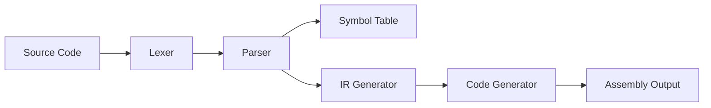

# ⚡ Mini Compiler

<div align="center">


**A modern, VS Code-styled compiler with full syntax highlighting and real-time compilation**

[Features](#-features) • [Installation](#-installation) • [Usage](#-usage) • [Architecture](#-architecture) • [Screenshots](#-screenshots)

</div>

---

## ✨ Features

### 🎨 Modern VS Code Interface
- **Dark Theme** - Beautiful VS Code Dark+ color scheme
- **Syntax Highlighting** - Real-time code coloring for keywords, operators, comments, and more
- **Activity Bar** - Quick access to file operations
- **Split View** - Side-by-side editor and output panels
- **Smart Tab System** - Multiple output views in organized tabs

### 🔧 Compiler Capabilities
- **Lexical Analysis** - Tokenizes source code with detailed token information
- **Syntax Parsing** - Validates code structure and builds parse trees
- **Symbol Table** - Tracks variables with scope management
- **IR Generation** - Produces intermediate representation code
- **Assembly Output** - Generates target assembly code
- **Error Reporting** - Clear, actionable error messages

### 💡 Developer Experience
- **File Management** - Open, save, and manage source files
- **Line Numbers** - Auto-updating line number display
- **Modified Indicator** - Visual feedback for unsaved changes
- **Keyboard Shortcuts** - `Ctrl+S` to save, `Ctrl+O` to open
- **Status Bar** - Real-time compilation status updates

---

## 🚀 Installation

### Prerequisites
```bash
Python 3.8 or higher
tkinter (usually comes with Python)
```

### Setup
```bash
# Clone the repository
git clone https://github.com/yourusername/mini-compiler.git
cd mini-compiler

# Install dependencies (if any)
pip install -r requirements.txt

# Run the compiler
python main.py
```

---

## 📖 Usage

### Starting the Compiler
```bash
python main.py
```

### Basic Workflow

1. **Write Code** - Use the left editor panel with syntax highlighting
2. **Click Run** ▶ - Compile your code
3. **View Results** - Check outputs in the tabbed panel:
   - **Tokens** - Lexical analysis results
   - **Symbols** - Variable and scope information
   - **IR Code** - Intermediate representation
   - **Assembly** - Generated assembly code
   - **Problems** - Errors and warnings

### Supported Syntax

```c
// Variable declarations
int x;
int y;

// Assignments
x = 10;
y = 20;

// Arithmetic operations
int sum;
sum = x + y;

// Output
print(sum);

// Conditionals
if (x < y) {
    int diff;
    diff = y - x;
    print(diff);
}

// Loops
int counter;
counter = 0;
while (counter < 5) {
    print(counter);
    counter = counter + 1;
}

// Comments
// Single line comment
/* Multi-line
   comment */
```

---

## 🏗️ Architecture

### Project Structure
```
mini-compiler/
├── main.py              # Entry point
├── gui.py               # VS Code-styled GUI
├── lexer.py             # Lexical analyzer (TokenScanner)
├── parser.py            # Syntax analyzer (SyntaxProcessor)
├── code_generator.py    # Code generator (AssemblyTranslator)
└── symbol_table.py      # Symbol table management
```

### Compilation Pipeline



### Components

| Component | Description |
|-----------|-------------|
| **TokenScanner** | Breaks source code into tokens (keywords, identifiers, operators) |
| **SyntaxProcessor** | Validates syntax and builds intermediate representation |
| **Symbol Registry** | Manages variables with scope and type information |
| **AssemblyTranslator** | Converts IR to assembly instructions |

---

## 📸 Screenshots

### Main Interface


*VS Code-styled editor with syntax highlighting and split-panel output*

### Compilation Results


*Detailed token analysis, symbol table, IR code, and assembly output*

---

## 🎯 Syntax Highlighting Colors

### Code Editor (VS Code Dark+)
- **Keywords** (`int`, `if`, `while`) - <span style="color: #C586C0">**Purple**</span>
- **Numbers** (`10`, `20`) - <span style="color: #B5CEA8">**Light Green**</span>
- **Comments** (`//`, `/* */`) - <span style="color: #6A9955">**Green**</span>
- **Operators** (`+`, `-`, `*`) - <span style="color: #D4D4D4">**White**</span>
- **Functions** (`print`) - <span style="color: #DCDCAA">**Yellow**</span>
- **Variables** - <span style="color: #9CDCFE">**Light Blue**</span>

### Output Panels
- **Instructions** - <span style="color: #569CD6">**Blue**</span>
- **Registers** - <span style="color: #CE9178">**Orange**</span>
- **Labels** - <span style="color: #DCDCAA">**Yellow**</span>
- **Errors** - <span style="color: #F14C4C">**Red**</span>
- **Success** - <span style="color: #89D185">**Green**</span>

---

## ⌨️ Keyboard Shortcuts

| Shortcut | Action |
|----------|--------|
| `Ctrl + S` | Save file |
| `Ctrl + O` | Open file |
| `F5` | Run compilation |

---

## 🛠️ Technologies Used

- **Python** - Core programming language
- **Tkinter** - GUI framework
- **Regular Expressions** - Pattern matching for lexical analysis
- **Custom Parser** - Recursive descent parsing

---

## 👨‍💻 Author

**Yeakin Iqra**

Built with ❤️ for compiler design final lab project

---

<div align="center">

**⭐ Star this repo if you find it helpful!**

Made with Python and Tkinter

</div>
